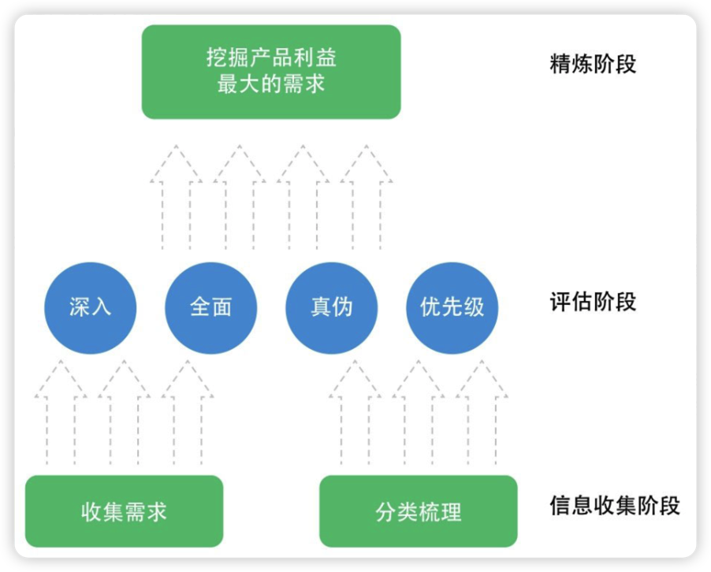
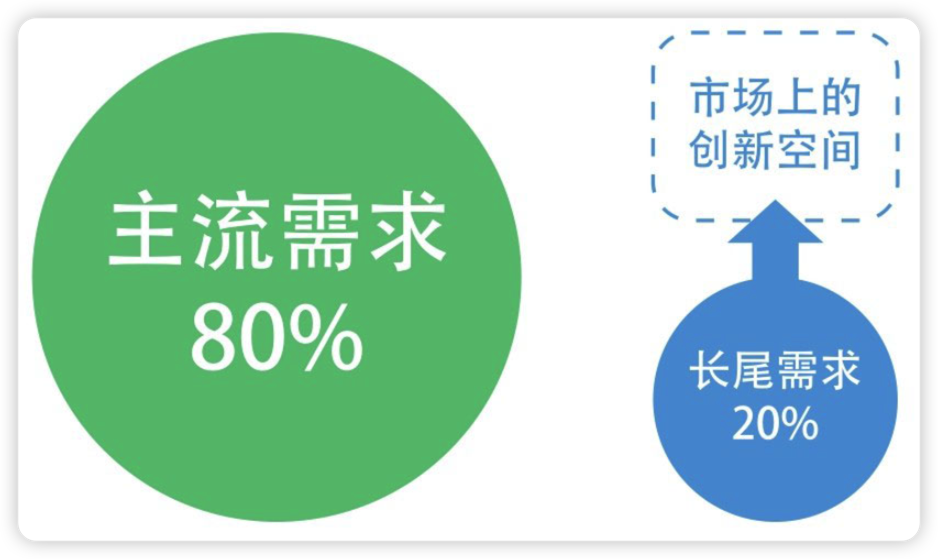
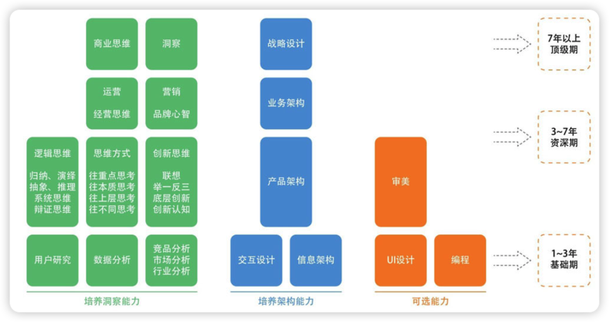

[[toc]]

# 1、产品经理的关键四要素：

- 创业：有创业的心态，才能顶住压力，坚持
- 求知：强烈的求知欲，对新鲜事务的好奇心，终身学习
- 联想：洞察能力（夯实基本功：用户分析，数据分析，市场分析）、归纳演绎能力
- 善断：在复杂变化的互联网场景或者意见分歧的时候能做出最有利于产品目标的决策

# 2、如何了解用户

> **《设计心理学》**
>
> **《用户体验要素》**

## 用户研究方法

- 深入访谈：找典型目标用户聊天
- 焦点小组：由一名主持人和一组用户（通常不超过8个人）在一个主题下进行访谈（焦点小组有可能会使用户说“假话”：为了面子、为了和别人不一样、为了隐私而隐藏自己的真实想法，需要避免这种情况出现）
- 问卷调查：一种定量研究
- 可用性测试：在一定的时间段内，通过请用户实际使用，以此来发现产品的问题并提出改进意见
- 留置研究：用户在实际场景里使用得出的，用户在这一过程中记录自己的使用感受、回答调研问题等，对产品的反馈更加完善和真实

## 用户研究需要考虑以下三个关键因素

- 用户是否是典型的目标用户？
- 挖掘到的信息是否真实？
- 怎么将用户研究的结论应用到产品设计中？

## 具备同理心，洞察心理和人性

> **《社会心理学》**

### 了解爱现心理

爱现心理即希望展现自己，或者叫成就感、认同感。

分析爱现心理，需要考虑以下几个方面：

- 每个人都有爱现心理，但为此付出的努力程度不同。
- 求之而不得，则会贪嗔痴。用户会为了满足自己的爱现心理而乐此不疲，付出很多努力，但求之不得的时候，就会变得贪嗔痴。
- 人总会有疲惫的那一天，穷极一生的为自己的兴趣而奋斗的人屈指可数。

### 群体用户心理

- 群体极化，会更加认同观点
- 向心力越强，群体越紧密，同时与外界也更加界限分明
- 适当允许不同群体间发生矛盾。适当的矛盾能让群体更加活跃，从而提高整个产品的活跃度。
- 留住群体中的意见领袖

### **如何在日常生活中培养自己理解用户、理解需求的能力？**

- **培养同理心**
  - 觉察自己：在自己对事、对人的反应中捕捉到自己行为背后的想法和原因，多问自己为什么，看到自己言行背后的起念动心，究竟是什么让自己潜意识的立即产生了某个反应？要跳出自我的影响，成为一个旁观者来剖析自己
  - 学习体察他人的感觉：将自己与用户的感受和表达方式区分开，避免受影响。要去想他如此表达背后的原因和想法是什么。观察用户，与用户聊天，以此来锻炼自己体察别人的能力。
- **设身处地的想：** 站在用户的角度去理解、感受他们的想法。积累对用户的感知，在具体的产品设计需求判断过程中运用对场景的预设和提问，来体察用户在这些场景下可能会有的反应。
- **发展多方面的兴趣，多出门食人间烟火：** 互联网隔了一层面纱，用户都是带着或大或小的面具在网络上生存，要想真实的了解不同的用户，就要走出家门。
- **玩RPG网游，短时间内体验人生**
- **从垂直到普适是非常漫长的过程：** 理解某一方面用户群体的需求和心理到理解普罗大众的需求和心理，这是一个漫长的过程，没有捷径，需要在成长的过程中保持体察用户的习惯，不断积累。

# 3、需求分析方法论

需求的本质就是———人人都可以参与讨论，人人都觉得自己理解需求

> 需求分析的常见工作图，一个需求分析方法的金字塔

## 收集需求

- **不要拒绝来自任何人的需求**，在收集需求时，需要将需求与身份、动机等区分开来，在之后分析需求的时候再考虑它们
- **从各个渠道获取需求**，包括但不限于产品内的反馈系统、新浪微博、知乎、微信群等
- **需求要有逻辑地进行组织**
  - 方便记录、检索，避免遗忘
  - 通过组织良好的需求池宏观的观察产品发展阶段的状态，结合当前和长远目标，更好的做优先级决策
- **需求也是符合二八原则的，80%的人提出的都是20%的需求。**在一个充分竞争的市场中，越是主流的需求，越是被充分挖掘，也就越显得竞争力不够。而那些尚未被发掘的需求，才可能是创新的所在

  

  > 长尾需求

## 探寻需求背后的动机

- 用户究竟为何要提出这个需求，背后的原因是什么？
- 假设老板提了一个不靠谱的需求，如何说服他呢？
  - **当某一个层面上无法达成一致时，往前推一个层面，在目标层面或者更深的层面上达成一致，然后分析两个层面之间的路径是否一致，目标、路径一致就更容易沟通。** 同时在沟通的过程中，辅以数据分析、调研情况，尽量将主观的沟通讨论引导到客观的分析说明上，这样的沟通就不会是观点、想法之争，面红脖子粗的场面也不会经常出现。
  - 如果想要说服老板批准执行需求，先**从双方的目标入手，目标达成一致之后再通过有条理的路径逐步分析需求**
  - 总之，就是**任何可能不在一个频道上的沟通，都需要先将沟通的双方调整到一个频道上**

## 评估需求实现的影响

- **分析一个需求的影响面：** 每个需求也会与其他需求相关联，甚至牵一发而动全身
- **分析一个需求的利弊：** 每个需求的实现都有利弊，是双刃剑

## 判断需求的真伪、有效性

从多个角度考量一个需求，角色、场景、流程方法

- **角色**：对同一个功能，不同角色的需求不一致。
- **场景**：分析需求真实发生的场景，考虑实际情况。
- **流程**：分析满足需求的关键路径，判断能否满足。

## 符合产品目标

> 机会都是探索出来的，很少是规划出来的

如何去判断哪些需求先做、哪些需求后做，甚至不做呢？

- 需要考虑需求与产品本身目标、定位的匹配程度
- 实现需求需要对产品有利，不能光满足用户，还需要满足产品的利益
- 产品目标通常分为短期目标和长期目标，长期目标与产品定位和战略挂钩，产品经理应当在日常工作中多多思考，思考眼前的短期目标需求与长期目标需求之间的精力投入占比至少应该达到1:1，这样才能最终让产品实现战略目标

## **四两拨千斤**

如何低成本的快速获取大量目标用户，而不是与竞争对手打持久战？

一个有效的办法是深入思考用户的需求重点、竞争对手真正薄弱的地方、自己能发挥巨大优势的地方，将这三者结合起来。

- **用户的需求重点：** 通常是用户选择产品时的需求痛点，或者用户迁移时的主要成本所在。
- **竞争对手真正薄弱的地方：** 竞争对手可能在某些地方有优势，但不要放过竞品的每一个弱点，并且要放大这些弱点。
- **自己能发挥巨大优势的地方：** 结合上面两个考虑，将它们转化成自己产品的优势，就可以拨动千斤之重的竞争对手的用户群。

## **用户口碑**

### **超出预期**

口碑的产生源自超出预期的满足了用户，带给了用户惊喜感。

**如何给用户惊喜感？**

- **快：** 在新事物出现的时候，你的产品是第一时间跟进的，甚至这个新事物就是你们创造的，那么感兴趣的用户会产生惊喜感
- **深：** 只要功夫深，铁杵磨成针。在细节上做深入思考与设计。
- **不同维度：** 在不同维度上，与用户最基本的感受拉开差距。

### 乐意传播

用户口碑最明显的特征就是用户会在自己的圈子里传播。

**如何引起用户传播？**

- **感同身受：** 即用户心理所谈论的——共鸣
- **打开眼界：** 人都有好奇心，未知而有趣的东西容易引发传播
- **展示自己：** 即用户心理所谈到的——爱现（希望展现自己）或者叫成就感、认同感

> **产品经理需要有一定的市场思维，这样才能更好的捕捉到用户乐意传播的点。在分析需求的时候，需要提前考虑传播，这样才能更好的打造口碑。**

### **大体量的用户**

满足大体量的用户需求，产生的口碑会有巨大的能量。如果人人都这样说，那用户口碑就会进化成一种潮流，品牌价值就会提升很多，相应的会带来巨大的用户增长。

# 4、产品经理的基本功

> 产品经理技能树

## 数据分析

> 《精益数据分析》

产品经理不需要成为数据分析的专家，但是需要回答以下几个问题：

- 什么时候分析数据？
- 分析哪些数据？
- 如何分析数据？
- 如何使用数据辅助决策？
- 如何使用数据驱动业务？

对于一个数据分析方面的一些感悟：

- 不能只看大数据，需要精细化分析。
- 需要看数据的变化、趋势。产品经理需要有敏锐的发现数据趋势的能力。
- 需要对比数据，做到心中有谱。这里最普遍的问题是，是否知道某项数据的天花板在哪里。对于一个数据，我们需要将其和天花板、大盘作对比。
- 找到关键数据（北极星数据）
