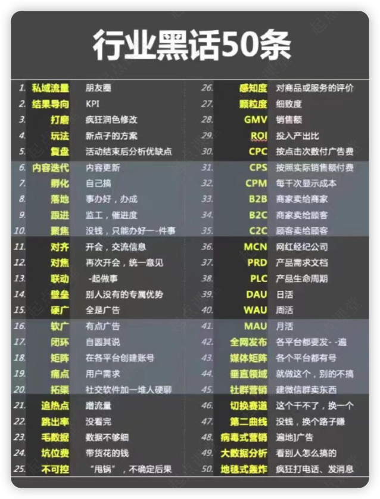

[[toc]]

## **一、 常见系统**

**1.Auth**

Authorization，业务人员要访问不同的内部业务系统，通过集中的权限管理平台将把全公司业务系统统管起来。

**2.CDP**

Customer Data Platform，客户数据中台，汇集所有客户数据并将数据存储在统一的、可多部门访问的数据平台中，让企业各个部门都可以轻松使用。

**3.CRM**

Customer Relationship Management，是指企业用CRM技术来管理与客户之间的关系。

**4.CallCenter**

呼叫中心就是在一个相对集中的场所，由一批服务人员组成的服务机构，通常利用计算机通信技术，处理来自企业、顾客的电话垂询，尤其具备同时处理大量来话的能力，

**5.DMP**

Data Management Platform，数据管理平台，是把分散的多方数据进行整合纳入统一的技术平台，并对这些数据进行

标准化和细分，让用户可以把这些细分结果推向现有的互动营销环境里的平台。

**6.ELearning**

Electronic Learning，数字化学习，通过应用信息科技和互联网技术进行内容传播和快速学习的方法。

**7.ERP**

Enterprise Resource Planning，企业资源计划。ERP是针对物资资源管理（物流）、人力资源管理（人流）、财务资源管理（财流）、信息资源管理（信息流）集成一体化的企业管理软件。它将包含客户/服务架构，使用图形用户接口，应用开放系统制作。除了已有的标准功能，它还包括其它特性，如品质、过程运作管理、以及调整报告等。ERP是为了提升企业各方面资源配置效率（包括包括销、财、供、物、产等因素），使之充分发挥效能使企业在激烈的市场竞争中全方位地发挥能量，从而取得最佳的经济效益。

**8.FMS**

财务管理系统分传统财务管理系统和现代财务管理系统。传统财务管理系统主要是以会计业务为基础，在此基础上扩充其他的一些财务操作。如总账管理、生产财务报表等。现代财务管理系统在传统的财务管理系统基础之上，再扩充了其他一些财务操作。大部分是关于理财方面的，比如个人所得税计算器、财政预算。目前，现代财务管理系统软件主要有Oracle电子商务套件、金碟、用友、易飞ERP系列等。

**9.GIS**

Geographic Information System，地理信息系统，它是在计算机硬、软件系统支持下，对整个或部分地球表层（包括大气层）空间中的有关地理分布数据进行采集、储存、管理、运算、分析、显示和描述的技术系统。

**10.HRM**

Human Resource Management，人力资源管理系统。

**11.MDM**

主数据管理是企业架构设计中非常重要的概念，一家企业应该有且只有一套客户资料存储系统和一套商品信息存储系统，以保证数据管理的一致性。

**12.Msg**

统一建设短信、通知、公告等各业务系统常用的通用功能模块，避免重复开发。

**13.MES**

制造企业生产过程执行管理系统，是一套面向制造企业车间执行层的生产信息化管理系统。

**14.OA**

Office Automation，是将现代化办公和计算机技术结合起来的一种新型的办公方式。主要提供资料查询、单据审批等功能，是最基本的、最常用的办公软件。

**15.Org**

organizations，组织架构体系。

**16.P4P**

Proactive network Provider Participation for P2P， 是P2P技术的升级版，意在加强服务供应商(ISP)与客户端程序的通信，降低骨干网络传输压力和运营成本，并提高改良的P2P文件传输的性能。

**17.Passport**

开展多个业务员的企业，建立一套统一的客户账号管理平台，可以让客户更加顺畅、便捷地体验企业的所有产品和服务。

**18.SCM**

supply chain management，广义指包括完整的供应商管理、采购管理、仓储和配送管理；

狭义指供应商管理。

**19.TMS**

Transportation Management System，运输管理系统，是一种“供应链”分组下的（基于网络的）操作软件，它能通过多种方法和其他相关的操作一起提高物流的管理能力。

**20.WMS**

Warehouse Management System，仓库管理系统，是通过入库业务、出库业务、仓库调拨、库存调拨和虚仓管理等功能，综合批次管理、物料对应、库存盘点、质检管理、虚仓管理和即时库存管理等功能综合运用的管理系统。

**21.中台**

中台是将系统的通用化能力进行打包整合，通过接口的形式赋能到外部系统，从而达到快速支持业务发展的目的。比如：业务中台，更多的是对业务的支持，比如客户信息，组织信息、产品信息等，这些都来自某一个系统，且分别支持多个系统的业务。提供给业务中台使用。

从技术角度，中台是为了搭建一个灵活快速应对变化的架构，可以快速实现前端提的需求，避免重复建设，这也是符合敏捷开发理念。

**22.SaaS**

SaaS平台是运营saas软件的平台。SaaS提供商为企业搭建信息化所需要的所有网络基础设施及软件、硬件运作平台，并负责所有前期的实施、后期的维护等一系列服务，企业无需购买软硬件、建设机房、招聘IT人员，即可通过互联网使用信息系统。SaaS 是一种软件布局模型，其应用专为网络交付而设计，便于用户通过互联网托管、部署及接入。

**23.内部IM**

如钉钉、企业微信、Lync等

**24.商户管理系统**

对入驻企业平台的商家，进行全面管理和控制，主要实现处理商家账号、管理商家订单、进行风险评估、资质审查等。

**25.商家自主管理系统**

为商家提供自主管理平台，实现商品管理、订单管理、营销管理、售后管理、广告投放等管理功能。此外，还涉及财务、报表管理等功能。

## **二、必懂的技术名词**

**1.技术架构**

技术架构是软件系统的结构设计，包括组件的组织方式、数据流动路径和组件间的交互方式。它关注系统的可维护性、可扩展性、性能和安全性，是软件系统设计的核心。

**2.应用层/表现层**

前端用户能够直接管制到的部分，包括：APP客户端、网页、电脑客户端。

前端的各种体验反馈：点击、弹窗、滑动等，都属于此层范畴。

应用层/表现层的工作，主要由前端工程师负责开发。

**3.业务服务层**

前端各项展示的结果依赖的各种规则、计算逻辑的集合。是系统架构中体现核心价值的部分。它的关注点主要集中在业务规则的制定、业务流程的实现等与业务需求有关的系统设计。

**4.接口层**

为业务服务层和前端表现层之间做数据传递和处理。

**基础服务层：**

前端通用的组件进行模块化的设计、开发与封装。通常是反复会用到的能力。如：系统Push、站内消息、电话能力、转账能力。

**数据层：**

对底层数据库的内容进行基础计算和包装，便于上层业务使用。如：点击率 = 点击次数/访问次数。点击次数、访问次数存于数据库，点击率通过数据层计算。

**数据库：**

所有互联网产品产生的数据组织、存储、管理的地方。由多张表之间相互连接的表格组成的数据库成为关系型数据库，是最常用的数据库类型。

## **三、常用技术术语**

**1.数据请求方式：GET，POST**

- GET：从服务端获取数据；
- POST：向服务端发送数据，创建新的内容；
- PUT：向服务端发送数据，更新已有内容；
- DELETE：向服务端发送请求，删除一个数据。

**2.接口与接口文档**

- 接口：接口的工作模式是前后端商量好接口定义的方法，后端定义好接口，前端按照规定的格式去请求，后端向前端返回数据。
- 接口文档：将某个接口定义（输入参数、请求方式、输出参数）记录下来的文档，是前后端协作的重要依据。
- 联调：前后端确认接口是否有按设计工作、是否通畅。

**3.控件、组件、框架**

- 控件：最小颗粒度的可编程部件，如：文字输入框、按钮。
- 组件：由多个控件组成，但比较常用的交互方式，通过组件来提升效率。如：多项选择器、下拉选择框、开关、日历。
- 框架：诸多控件和组件组合在一起，能够在某一领域完成一些列操作的组合。比如，页面模板、表单。

**4.Cookie和Sessio**n

- Cookie：服务器给客户端的身份记录凭证，存放在客户端。
- Session：使用产品时，在服务端的唯一标识。Session状态存在服务端，标识ID存在客户端。

**5.Token**

是由id、时间戳、设备号，配上自定义规则，经过算法加密后的一串字符串。字符串通常很长，难伪造。

**6.同步和异步**

- 同步：发出指令后，暂停其他任务，以最快速度得到指令返回的结果；
- 异步：发出指令后，其他任务继续，等待执行完成才得到结果，反馈给前端。

同步适合于响应速度快的场景，如果因计算量大而使响应速度较慢，采用异步返回更佳，减少用户等待的焦虑感。

## **四、产品相关**

**1.BRD**

Business Requirements Document，商业需求文档。基于商业目标或价值所描述的产品需

求文档或报告。主要描述产品价值是什么？这个产品解决了什么问题。

**2.MRD**

Market Requirements Document，市场需求文档。市场部门的产品经理或者市场经理编写的产品的说明需求文档，主要描述相对于竞品，产品的优势是什么，更好的向用户介绍产品优点。

**3.PRD**

Product Requirement Document，产品需求文档。将产品规划和设计的需求具体形象化表述出来的一种展现形式，即描述这个产品的具体细节。

**4.MVP**

Minimum Viable Product，最小化可行性产品。MVP不是每个迭代做出产品功能的一部分，而是每次迭代都要交付一个可用的最小功能集合，这个集合的功能可以满足用户的基本需求，虽不完善但至少可用。然后逐次迭代做出满足客户预期的产品，直至最后完全满足客户需求。

**5.产品生命周期**

是指产品从准备进入市场开始到被淘汰退出市场为止的全部运动过程，包括导入（进入）期、成长期、成熟期（饱和期）、衰退（衰落〉期四个阶段。是由消费者的需求、消费方式、消费水平、消费心理以及影响市场变化等多种因素决定的。

**6.Roadmap**

Roadmap 是产品经理进行产品管理的一个中长期规划，是一张产品发展的规划图，提醒产品经理产品的完成进度，完成到哪里，哪些功能已经完成，当前的任务是什么等等。主要包含时间周期、里程碑和工作项。

**7.多态**

就是多种形态，比如微博点赞除了常规的大拇指还可以用笑脸、愤怒等表情形式来表达。

**8.Feed**

信息流，原意为喂养，用在这里可以理解为：用户需要什么，我们就给用户提供什么。Feed流主要有3中常见形式：文字流、图片流、视频流。比如常见的朋友圈、今日头条、知乎等都是feed。

**9.IM**

Instant Messaging，即时通讯软件，即QQ、微信、飞书等通信工具型产品。

## **五、交互设计相关**

**1.UI（GUI）**

Graphical User Interface ，图形用户界面，特指软件的界面设计，狭义上指我们正在讨论的IT互联网行业。UI即是GUI的简称，这二者没有任何区别。即：我是个GUI设计师，或我是个UI设计师，是一样的。

**2.UID**

User Interface Design，用户界面设计。

**3.UE**

User Experience，用户体验。

**4.UX**

等同于User Experience 用户体验（UE），不同的缩写而已

**5.UED**

User Experience Design，用户体验设计。

**6.UCD**

User Centered Design，以用户为中心的设计。

## **六、研发/测试相关**

**1.提测**

就是研发开发完之后，打包提交给测试人员开始测试。

**2.复现**

之前测试发现的bug，再次出现。

**3.测试用例**

测试人员根据产品经理的PRD撰写的测试流程及事项。

**4.功能测试**

单一功能的测试，比如本迭代要做一个分享功能，功能测试是只测试分享功能是否符合产品要求。

**5.回归测试**

可以理解为整体测试，本迭代要上线一个分享功能，要测试一下这个功能有没有影响其他功能的正常使用。

**6.测试报告**

测试完成之后，测试人员撰写的说明BUG均已修复，可以上线的邮件。

**7.开发走查**

走查就是根据一定的要求和标准，对功能需求、交互设计、UI方案等等从头到尾进行一次问题的发现与总结，便于修改与完善。目的是校验开发完成后的的产品各方面的「还原度」。

## **七、项目相关**

**1.敏捷开发**

把产品功能拆解，每次只设计和实现这个产品的一部分，然后一步一步完成整个产品能

的方式叫做敏捷开发。

**2.需求评审**

产品经理通过向团队其他成员（开发、测试、运营）对需求的相关内容进行阐述、说明或者演示，使团队成员对需求的理解保持一致，统一整个产品团队的自标，从而使得产品达到预期效果。

**3.项目排期表**

根据项目定好每个参与方的具体工作内容，以及起止时向的计划表。

**4.甘特图**

以图示的方式，通过活动列表和时间刻度形象地表养出任何特定项目的活动顺序和持续时

间，主要用于项目管理。

## **八、数据分析相关**

**1.PV**

Page View，页面访问量。比如：同一个账号访问同一个页面两次，则PV为2。

**2.UV**

Unique Visitor，页面访问人数。指访问某个站点或点击某条新闻的不同IP地址的人数。比如：同一个账号访问同一个页面两次，UV算1。

**3.VV**

Visit View 访问网站的次数，这个不同于PV，它计算的用户访问该网站的次数，而不是点

击打开一个页面的次数。简单的说，当你浏览了这个网站的5个页面，然后关掉了这个网

站，那么你制造的VV就等于1，而PV为5。

**4.DAU**

日活跃用户数量，也叫做日活，指一天内打开app的用户数。

**5.MAU**

月活跃用户数量，也叫做月活，指一个月内打开app的用户数。

**6.留存**

顾名思义，留存指的就是“有多少用户留下来了”。用户在某段时间内开始使用应用，经过一段时间后，仍然继续使用该应用的用户，被认作是留存用户。

**7.留存率**

获得的新用户，隔一段时间后继续使用产品的比例。

**8.次日留存率**

获得的新用户，第二天继续使用产品的比例。

**9.7日留存率**

获得的新用户，第七天继续使用产品的比例。

## **九、运营相关**

**1.UGC**

User-generated Content，用户生产内容，也称UCC，User-created Content

**2.PGC**

Professionally-generated Content，专业生产内容，也称PPC，Professionally-produced Content，以专业身份（专家）贡献具有一定水平和质量的内容，如微博平台的意见领袖、科普作者和政务微博

**3.OGC**

Occupationally-generated Content，职业生产内容，以提供相应内容为职业（职务），如媒体平台的记者、编辑

**4.KOL**

Key Opinion Leader，关键意见领袖，拥有较大影响力、有一定的粉丝群体的人。可以理解为网红。

